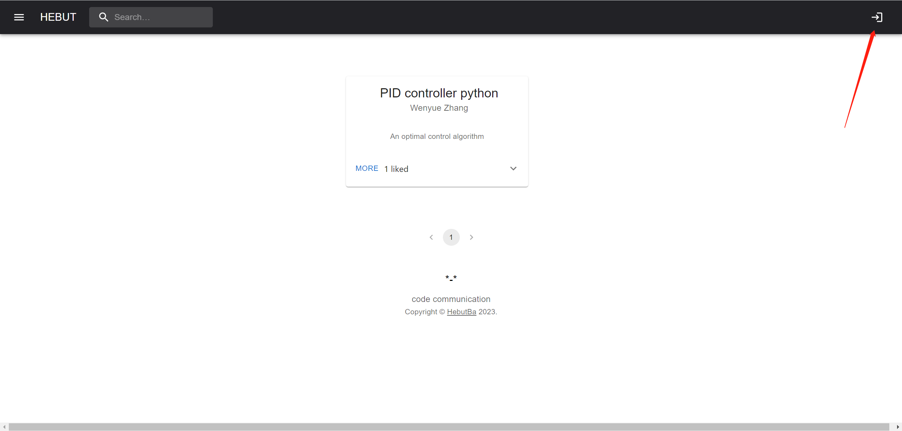
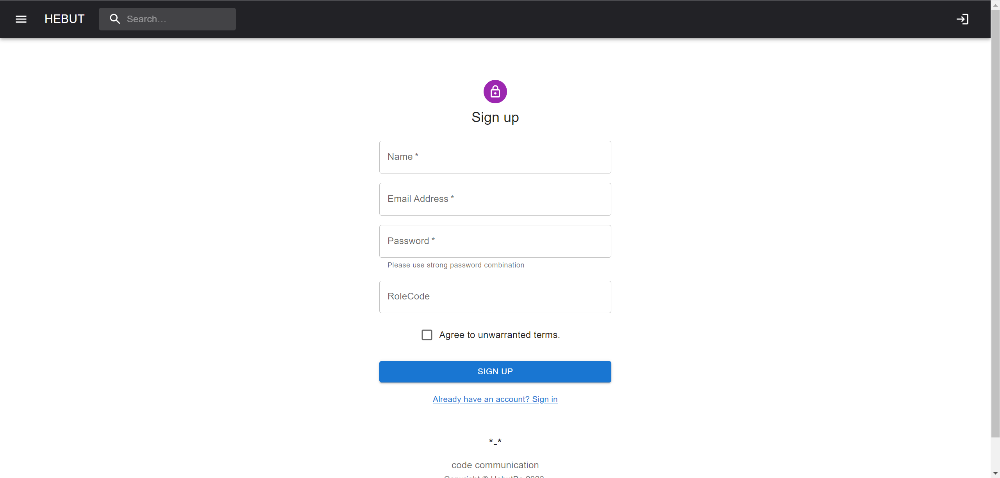

## installation guidelines

### Installation dependency
Enter the root directory
```
npm install
```

### Run
Start the server
```
npm run dev:server
```
and enter browser then  
[click here](http://localhost:1234/)

## user manual
#### Sign in

Click here to log in. You cannot comment or post codeSnippet without logging in.

#### Sing up


Sign up interface.
Please note that your password type must be a strong password combination (at least one uppercase and lowercase letter, and contain numbers and special symbols) 
