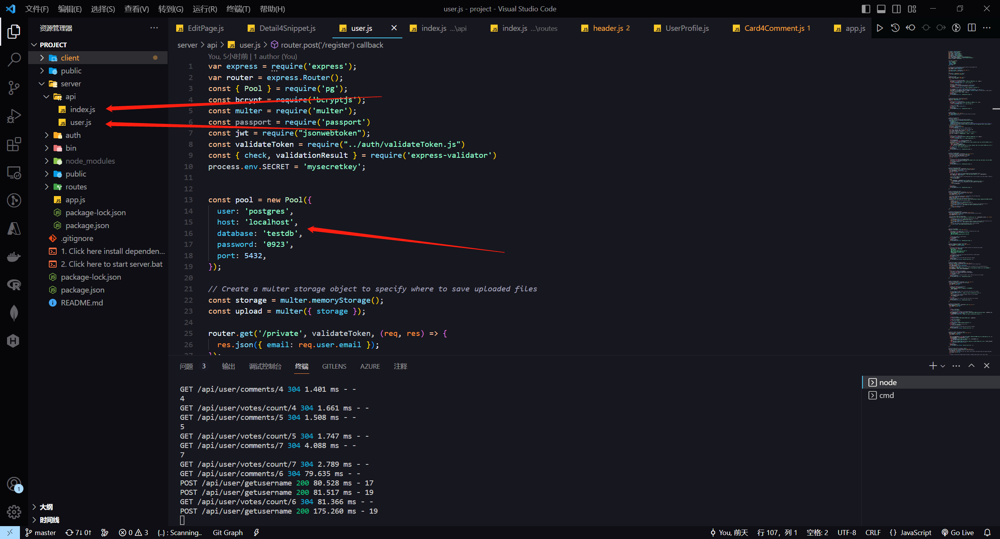

## Installation guidelines :eyes:

### Installation dependency  

> Node.js is a cross-platform, open-source server environment that can run on Windows, Linux, Unix, macOS, and more. Node.js is a back-end JavaScript runtime environment, runs on the V8 JavaScript Engine, and executes JavaScript code outside a web browser.  
The version of nodejs we used is v19.3, if you don't have node.js installed:  
[node.js Installation instruction](https://docs.npmjs.com/downloading-and-installing-node-js-and-npm)
Don't worry it's very simple:)

Enter the root directory, and open a terminal
```
npm install
```

### Configuring database connections :elephant:


You can adjust the PostgreSQL connection parameters in the beginning of the /server/api/index.js and user.js files.

### Run :running:
Start the server
```
npm run dev:server
```
and enter browser then [click here](http://localhost:1234/) or type http://localhost:1234

## user manual
#### Sign in

Click here to log in. You cannot comment or post codeSnippet without logging in.

#### Sing up


Sign up interface.
:kissing_smiling_eyes:Please note that your password type must be a strong password combination (at least one uppercase and lowercase letter, and contain numbers and special symbols) 
